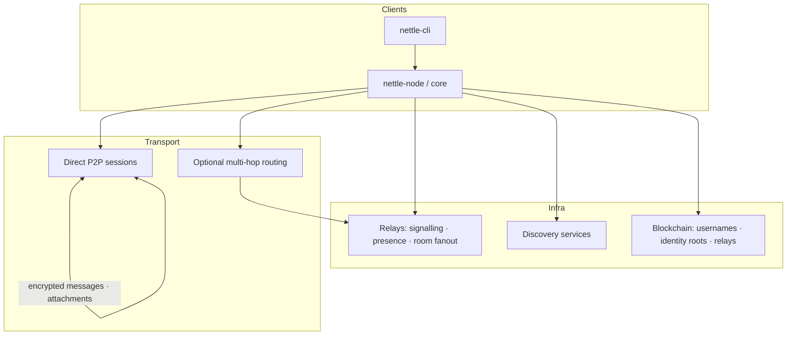

# Nettle

Open-source peer-to-peer social chat network with blockchain-backed identity,
transferable usernames, local-first history, and privacy-routed discovery.

> **Status:** TypeScript monorepo with 77 passing tests. Crypto, protocol,
> storage, client, workers, and TUI scaffolded and working. Chain `.in`
> app not yet implemented.

Nettle should feel like a modern mix of Usenet, IRC, peer-to-peer messaging,
and social discovery — without a central message store.

## What users get

- Globally unique, transferable usernames rooted in wallet identity
- Public ownerless chatrooms
- Private end-to-end encrypted DMs and group chats
- Sender-held offline messages (no relay mailbox for private content)
- Multi-device accounts with peer-to-peer history transfer
- Interest / language / random discovery, with private routing for strangers
- Free standard use — no payment required for messaging or usernames

## Core principles

| Principle | Meaning |
|---|---|
| Local-first | Private history lives on user devices |
| P2P by default | Direct peer transfer when possible |
| E2EE | Relays never see private plaintext or long-term keys |
| Cryptographic identity | Wallet root; device-signed messages |
| Immutable communication | No edit / unsend protocol |
| Minimal social state | Exact online presence, delivered receipts only |
| Open protocol | Independent implementations welcome |
| Free user access | Infrastructure funded outside the chat UX |

## Architecture (overview)



Five layers:

1. **Client** — wallet, keys, local store, encrypt/sign, queue, UI/CLI
2. **P2P transport** — DM sessions, attachments, room gossip, device sync
3. **Discovery / presence** — username resolve, online leases, matching
4. **Relays** — signalling, NAT assist, optional onion path, public rooms
5. **Blockchain** — own chain (inauguration `.in` state machine); scarce authoritative state only (not private chat)

Full system map: [`docs/architecture.md`](docs/architecture.md)

## One-sentence definition

Nettle is an open-source, wallet-identified, peer-to-peer social chat network
with transferable blockchain usernames, local-only history, sender-held
offline messages, public ownerless chatrooms, private encrypted conversations,
and privacy-routed stranger discovery.

## Repository layout (planned)

```text
nettle/
  package.json            # Bun workspace
  tsconfig.json
  packages/               # TypeScript packages
    types/                # @nettle/types — protocol types
    crypto/               # @nettle/crypto — noble crypto wrappers
    protocol/             # @nettle/protocol — CBOR CDE, event signing
    storage/              # @nettle/storage — encrypted local DB
    client/               # @nettle/client — messaging, rooms, groups
    tui/                  # @nettle/tui — OpenTUI + SolidJS terminal client
    chain-client/         # @nettle/chain-client — chain API
  workers/                # Cloudflare Workers
    relay/                # signalling, room gossip
    presence/             # presence leases
    discovery/            # interests, language, random match
  chain/                  # inauguration .in state machine (AD-3)
  docs/
  test-vectors/
  schemas/
```

## Documentation

| Doc | Topic |
|---|---|
| [docs/README.md](docs/README.md) | Doc index |
| [docs/architecture.md](docs/architecture.md) | Layers, topology, data flow |
| [docs/principles.md](docs/principles.md) | Product principles |
| [docs/identity.md](docs/identity.md) | Wallet, username, passkeys, devices |
| [docs/profiles.md](docs/profiles.md) | Bio profile fields (AD-24) |
| [docs/chain.md](docs/chain.md) | On-chain scope, token, treasury |
| [docs/consensus.md](docs/consensus.md) | HotStuff consensus (AD-9) |
| [docs/messaging.md](docs/messaging.md) | DMs, offline queue, receipts, ordering |
| [docs/cryptography.md](docs/cryptography.md) | Primitives and session design |
| [docs/transport.md](docs/transport.md) | Direct / routed / fallback modes |
| [docs/presence.md](docs/presence.md) | Exact online leases |
| [docs/discovery.md](docs/discovery.md) | Interests, language, random match |
| [docs/groups.md](docs/groups.md) | Private creator-owned groups |
| [docs/rooms.md](docs/rooms.md) | Public ownerless chatrooms |
| [docs/attachments.md](docs/attachments.md) | Encrypted blob transfer |
| [docs/multi-device.md](docs/multi-device.md) | Fanout and history sync |
| [docs/storage.md](docs/storage.md) | Local encrypted DB |
| [docs/protocol.md](docs/protocol.md) | Event model and encoding |
| [docs/apis.md](docs/apis.md) | Service surface |
| [docs/reputation.md](docs/reputation.md) | Random-match reputation |
| [docs/moderation.md](docs/moderation.md) | Abuse boundaries |
| [docs/privacy.md](docs/privacy.md) | Content vs metadata privacy |
| [docs/threat-model.md](docs/threat-model.md) | Adversaries and guarantees |
| [docs/mvp.md](docs/mvp.md) | First shippable slice |
| [docs/phases.md](docs/phases.md) | Implementation phases |
| [docs/defaults.md](docs/defaults.md) | Product defaults |
| [docs/open-decisions.md](docs/open-decisions.md) | Unresolved design issues |
| [docs/stack.md](docs/stack.md) | Recommended technology stack |
| [docs/agent-notes.md](docs/agent-notes.md) | Coding-agent constraints |

## MVP snapshot

In: local identity, dev chain usernames, presence, direct E2EE DMs with
sender-side offline queue, public rooms, basic discovery + random match,
attachments, open-source relay, CLI client.

Out: production tokenomics, automated relay mining, full onion routing,
nearby discovery, polished GUI, calls/video.

Details: [`docs/mvp.md`](docs/mvp.md) · phases: [`docs/phases.md`](docs/phases.md)

## Status

Specification and documentation only. Implementation has not started.

## License

[ISC](LICENSE) — open protocol, independent implementations encouraged.

## Contributing

Protocol and reference code will be developed in the open. Until crates land,
design discussion belongs in issues against the docs in `docs/`.
