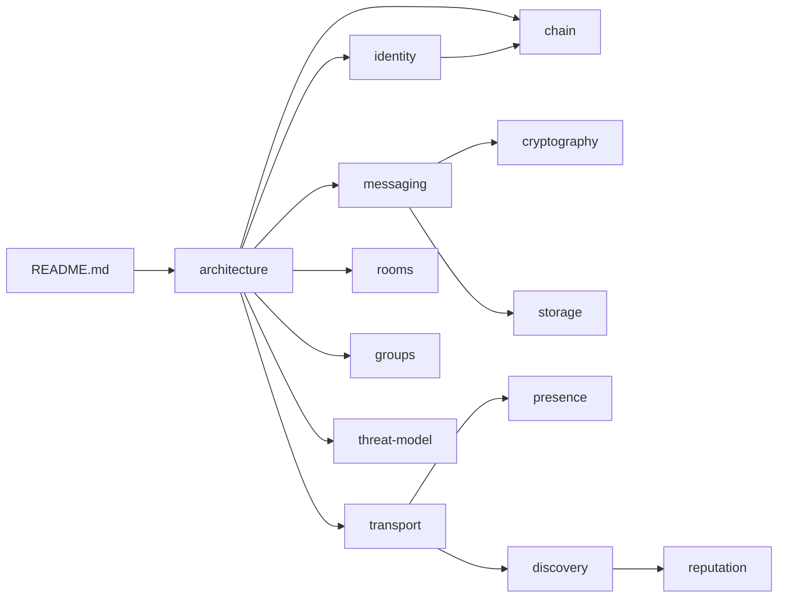

# Nexnet documentation

Canon for product, protocol, and implementation direction.

**Status:** active architecture and implementation documentation. The
TypeScript/Bun foundation is in the repository; the end-to-end MVP is not yet
complete.

## Start here

1. [Architecture](architecture.md) — system layers and flows
2. [Principles](principles.md) — non-negotiables
3. [MVP](mvp.md) + [Phases](phases.md) — what ships first
4. [Defaults](defaults.md) — product defaults
5. [Open decisions](open-decisions.md) — intentionally unresolved

## Identity and chain

- [Identity](identity.md) — wallet root, usernames, passkeys, devices, recovery
- [Profiles](profiles.md) — bio (no avatar) AD-24
- [Chain](chain.md) — on-chain vs off-chain, treasury, token purpose
- [Consensus](consensus.md) — NexnetHotstuff (chained HotStuff, AD-9)

## Messaging and crypto

- [Messaging](messaging.md) — DMs, offline queue, receipts, ordering
- [Cryptography](cryptography.md) — primitives, Double Ratchet, MLS
- [Protocol](protocol.md) — canonical events and encoding
- [Storage](storage.md) — local encrypted database
- [Multi-device](multi-device.md) — fanout and history transfer
- [Attachments](attachments.md) — encrypted blob transfer

## Network

- [Transport](transport.md) — direct, private routed, fallback relay
- [Presence](presence.md) — exact online leases
- [APIs](apis.md) — chain / presence / signalling / discovery surfaces

## Social surfaces

- [Rooms](rooms.md) — public ownerless chatrooms
- [Groups](groups.md) — private creator-owned groups
- [Discovery](discovery.md) — interests, language, random match
- [Reputation](reputation.md) — matching gates, not a public score

## Safety

- [Privacy](privacy.md) — content vs metadata
- [Threat model](threat-model.md) — attackers and guarantees
- [Moderation](moderation.md) — local controls and abuse limits

## Build

- [Stack](stack.md) — recommended libraries and runtimes
- [Agent notes](agent-notes.md) — constraints for coding agents

## Doc map

