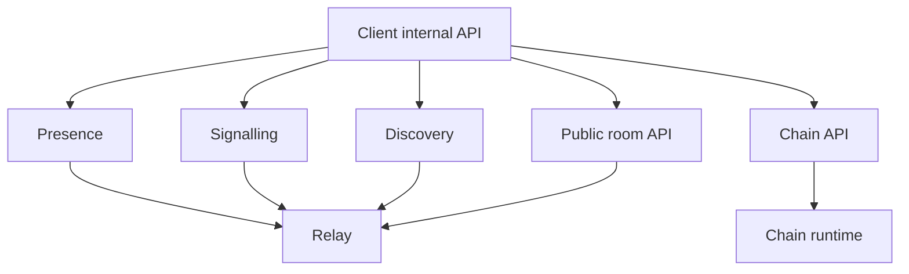

# APIs and services

Interfaces are separated so implementations can evolve independently.

## Chain API

```text
register_username
resolve_username
get_identity_root
publish_relay_record
list_relays
get_protocol_parameters
```

## Presence API

```text
publish_presence_lease
query_presence
subscribe_presence
remove_presence
```

## Signalling API

```text
create_session_offer
send_session_answer
publish_transport_candidate
request_relay_path
close_session
```

## Discovery API

```text
publish_discovery_profile
remove_discovery_profile
search_by_interest
search_by_language
search_nearby
find_mutuals
request_random_match
publish_group_listing
search_groups
```

## Public room API

```text
subscribe_room
unsubscribe_room
publish_room_event
fetch_recent_room_events
announce_room_peer
```

## Client internal API

```text
send_message
retry_outbound_message
acknowledge_delivery
create_group
add_group_member
remove_group_member
send_group_message
join_room
leave_room
send_attachment
sync_device_history
```


