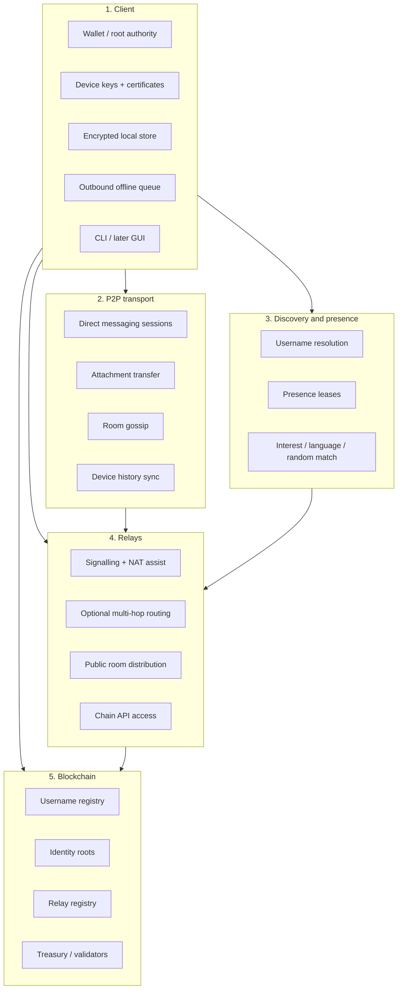
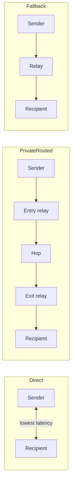
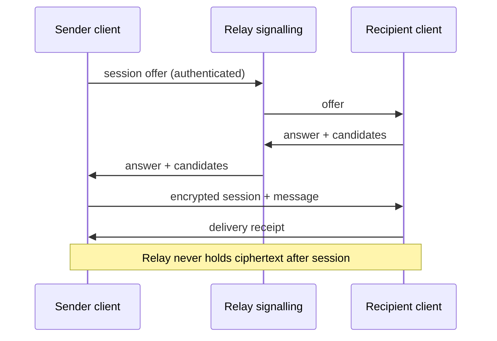
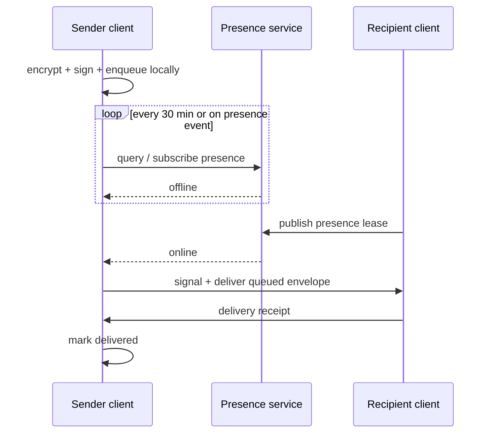

# Architecture

Nexnet has five major layers. Messaging code must not depend on a specific
consensus implementation; the chain sits behind a client interface.

## Layers



### 1. Client

Responsible for account creation, wallet management, passkey auth, device
keys, local storage, sign/encrypt, presence publication, discovery, delivery
retries, peer sessions, rooms, groups, attachments, local reputation, and
same-account history sync.

### 2. Peer-to-peer transport

Direct messaging sessions, attachment transfer, real-time chatroom gossip,
private group communication, device-to-device history sync, delivery ACKs.

### 3. Discovery and presence

Username resolution, online presence, interest/language/location/mutual
matching, group discovery, link discovery, random matching.

### 4. Relays

WebRTC/QUIC signalling, STUN/TURN-like assist, optional onion routing, peer
rendezvous, public room event distribution, discovery index replication,
chain API access, health publication.

**Relays must not permanently store private messages.**

### 5. Blockchain

Globally shared scarce or authoritative state only:

- username registration and ownership
- identity root records
- authorised credential commitments
- protocol treasury, validators, relay registry
- optional group ownership / governance later

**Never:** private messages, attachments, presence history, contact graphs,
exact location, read state, conversation metadata.

**Locked:** Nexnet’s own chain. State transition logic in **inauguration**
`.in` (`../inauguration`). Clients use `chain-client` only — no direct
dependency on consensus internals. Multi-validator: chained HotStuff
three-chain commit ([consensus.md](consensus.md), AD-9). See
[chain.md](chain.md).

## Connection modes



| Mode | Use | Trade-off |
|---|---|---|
| Direct | Trusted contacts, attachments | Peers may see each other's IPs |
| Private routed | Random matching default | Higher latency/cost; path partial visibility |
| Fallback relay | NAT failure | Transient encrypted relay only; no history store |

Default policy:

- existing trusted contacts → direct when possible
- random matching → private routed by default
- public rooms → relay-assisted gossip
- attachments → direct when possible
- fallback when direct fails

## Message path (DM online)



## Message path (DM offline)



Undelivered private messages stay on the **sender device**. The sender must
be online for delivery.

## Package boundaries

```mermaid
flowchart TB
  TUI[@nexnet/tui] --> Client[@nexnet/client]
  Client --> Proto[@nexnet/protocol]
  Client --> Crypto[@nexnet/crypto]
  Client --> Store[@nexnet/storage]
  Client --> Types[@nexnet/types]
  Client --> ChainC[chain-client interface]
  Relay[worker-relay] --> Types
  Presence[worker-presence] --> Types
  Discovery[worker-discovery] --> Types
  ChainC --> Chain[chain/ .in]
```

Rule: **chain-runtime is isolated**. Messaging depends on `chain-client`
interfaces only.

**AD-2:** `chain/` holds state transitions in inauguration `.in`. Client,
relay, presence, discovery, TUI, and chain-client code use TypeScript/Bun.

## Trust sketch

Users trust: own devices, wallet custody, passkey/platform secure storage,
reviewed crypto libraries, chain consensus for username ownership.

Users need not trust: individual relays with plaintext, random peers, public
room publishers, discovery services with private message content.

See [threat-model.md](threat-model.md) and [privacy.md](privacy.md).
