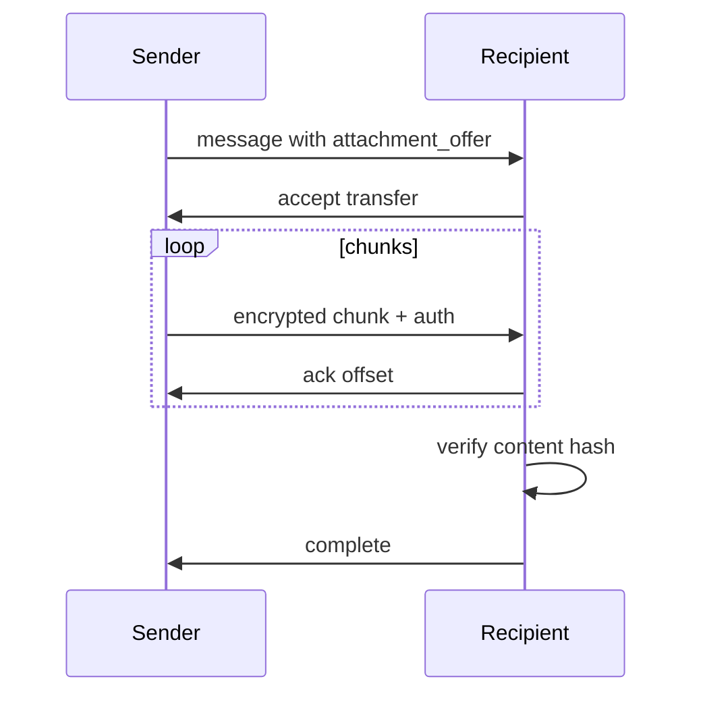

# Attachments

Attachments are direct encrypted blob transfers.

## Requirements

- direct peer-to-peer transfer by default
- end-to-end encryption
- content integrity verification
- resumable transfer
- no permanent server storage
- no automatic relay-side upload
- optional routed transport later

## Offline behaviour

If both peers are not online simultaneously, the attachment cannot transfer.

Recipient sees a pending attachment offer until the sender returns online.

## Attachment offer

```text
attachment_offer {
  attachment_id
  filename
  mime_type
  size
  encrypted_content_hash  // BLAKE3-256 (AD-8)
  transfer_capabilities
  expires_at?
}
```

Metadata is encrypted inside the message payload.

## Transfer protocol

Recommended:

- chunked transfer
- per-chunk authentication
- resume offsets
- final content hash verification
- explicit recipient acceptance for large files
- configurable size limits



Interrupted transfers resume. Corrupted chunks fail verification.
