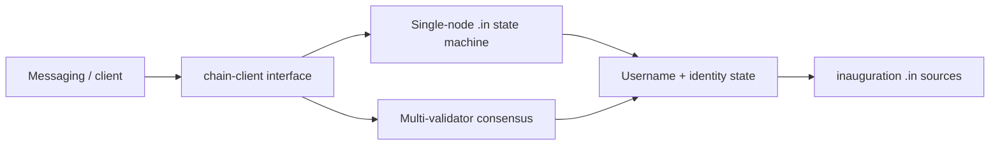

# Blockchain

The chain holds globally shared scarce or authoritative state.

It must **not** contain private chat content.

## On-chain

```text
username -> owner wallet
wallet -> identity root
wallet address = Ed25519 root signing public key
wallet -> at most one owned username (AD-10)
wallet -> authorised passkey commitments
identity protocol version
relay registrations
validator set
protocol treasury
group_id -> creator (AD-23)
```

State transition logic for these records is the chain app — implemented in
`.in` (inauguration), verified by tests/vectors, exposed to clients over the
chain API.

**AD-10:** `register_username` fails if the identity already owns a username.
Transfers are disabled to prevent squatting and flipping.

## Off-chain (must stay off)

- private messages
- private message hashes by default
- private group messages
- attachments
- detailed presence history
- contact graphs
- exact location
- reports containing private plaintext
- read state
- conversation metadata

## Token purpose

May fund:

- validator incentives
- protocol treasury
- relay incentives / staking
- governance later
- anti-spam deposits later

Must **not** gate normal messaging, rooms, discovery, username registration,
or ordinary account use.

## Treasury model (first stage)

Avoid automated bandwidth mining initially.

Recommended:

- genesis treasury allocation
- official infrastructure funded by treasury grants
- validators receive predictable emissions or treasury payments
- relay operators may receive approved grants
- automatic proof-of-bandwidth deferred

Reason: operators can fabricate traffic and receipts; auto bandwidth rewards
are hard to secure.

## Implementation boundary

Consensus is a **separate module**.

### Locked decision (AD-1)

Nexnet runs a **purpose-built chain**, not a third-party L1/L2 product.

Chain application logic and (as language surface matures) runtime pieces are
written in **inauguration** (`.in` / Core IR) from the sibling project
[`inauguration`](https://github.com/tschk/inauguration) at `../inauguration`.

Messaging still talks only through `nexnet-chain-client`. Chat work must not
block on full consensus maturity — a local single-node / deterministic
executor of the same state machine is valid until multi-validator consensus
lands.



### Consensus (AD-9)

**Locked:** chained **HotStuff** with **three-chain commit** (NexnetHotstuff).

- partially synchronous BFT, `n = 3f + 1`, quorum `> 2/3` power
- deterministic finality; epochs; Ed25519 votes first (BLS QCs later)
- same execution interface for single-validator and multi-validator modes

Full design: [consensus.md](consensus.md).

### Why own chain + inauguration

- scarce state surface is small (usernames, identity roots, relays, treasury)
- protocol control without foreign L1 policy
- same org owns language toolchain and network
- independent chain implementers still possible via open specs + ISC

See [open-decisions.md](open-decisions.md) for emissions and remaining validator
economics.
