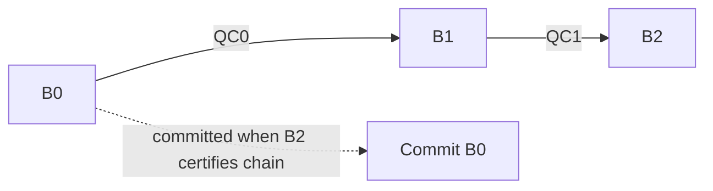
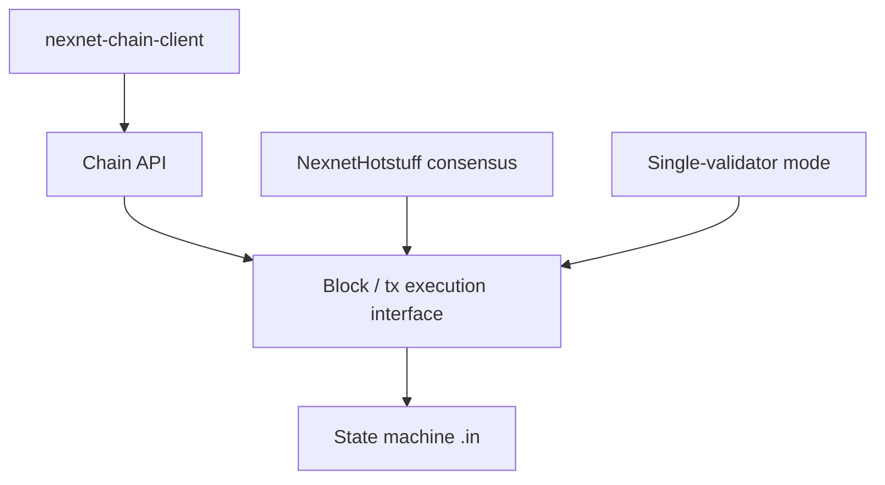

# Consensus (AD-9)

**Locked:** HotStuff-family — conservative **chained HotStuff** with
**three-chain commit** for the first multi-validator version.

Working name: **NexnetHotstuff**. Safety core stays recognisably standard
HotStuff; customisation is staking, epochs, mempool, and Nexnet state only.

Single-validator / local executor mode uses the **same** block and execution
interfaces.

## Model

```text
model: partially synchronous BFT
validator count: n = 3f + 1
quorum: 2f + 1 weighted votes (greater than two-thirds power)
leader: rotates every view
finality: deterministic (no probabilistic confirmations)
pipeline: one proposed block per view
commit rule: three certified blocks in a direct chain
```

HotStuff property to preserve: after the network stabilises, a correct leader
can progress according to actual delay, with linear communication per
successful view and during leader changes.

## Block

```text
block {
  version
  chain_id
  epoch
  view
  height

  parent_id
  justify_qc

  proposer
  timestamp
  transactions_root
  state_root

  signature
}
```

## Vote

Validators vote over a block digest:

```text
vote {
  chain_id
  epoch
  view
  block_id
  validator_id
  signature
}
```

## Quorum certificate

Votes representing at least two-thirds of validator power form a QC:

```text
quorum_certificate {
  epoch
  view
  block_id
  signer_bitmap
  aggregate_signature
}
```

**Signatures (v1):** Ed25519 votes — easier to debug and audit; QCs larger.

**Later:** BLS aggregate QCs so many votes collapse to one signature + bitmap.

## Commit rule (three-chain)

```text
B0 <- B1 <- B2
      QC0   QC1
```

When `B2` extends `B1`, which extends `B0`, with the required consecutive QCs,
`B0` becomes committed.

Chained HotStuff pipelines phases across blocks rather than running every
phase separately for one block.



## Explicitly not first version

- Fast-HotStuff
- Jolteon / other two-chain fast paths
- Novel locking or voting rules
- Optimistic one-chain finality
- Instant mid-epoch validator-set changes
- Consensus over chat messages

Two-chain / async fallback only after the base protocol is tested.

## Nexnet customisation (safe surface)

### Proof of stake

```text
voting_power = bonded_stake
effective_power = min(raw_stake, validator_power_cap)
```

Caps limit concentration so few holders cannot own username registration.

Early committee sizes:

```text
minimum validators: 4      // f=1
initial target: 7–21
later target: 50–100
```

### Epochs

Validator membership changes **only** at epoch boundaries:

```text
epoch length: 10,000 blocks
pending changes activate next epoch
validator set hash embedded in epoch-opening block
```

Last committed block of epoch `e` defines the set for epoch `e + 1`.
Next epoch starts only after a transition block commits under the **old** set.

### Leader selection

v1 deterministic:

```text
leader = validators[view mod validator_count]
```

Later stake-weighted pseudorandom:

```text
leader = sample(
  validator_set,
  seed = previous_epoch_randomness || view
)
```

Current proposer must not choose randomness used to select future proposers.

### Pacemaker

Separate from the state machine:

```text
initial timeout: 1 second
on timeout: timeout *= 1.5
on successful progress: gradually reduce timeout
```

On timeout, validator broadcasts:

```text
timeout {
  epoch
  view
  high_qc
  validator_id
  signature
}
```

`2f + 1` timeout messages → timeout certificate; next leader advances safely.

### Mempool / workload

Chain workload is small (not chat content):

- username registration and inactivity release
- identity key changes
- passkey / device authorisation records
- validator and staking operations
- relay registry records
- optional group ownership later

```text
target block time: 1–2 seconds
max block size: ~256 KiB initially
transaction expiry: explicit epoch or block height
```

Users are not meant to pay per tx. Ordering is fee-independent and
deterministic, e.g.:

```text
priority class
transaction expiry
received bucket
transaction hash
```

Do **not** use exact local arrival time as consensus-visible ordering.

### Free writes and spam

Token may fund validators without user fees. Free writes need quotas, e.g.:

```text
username ownership: max 1 per identity (AD-10)
username registration: fails if identity already owns one;
                       also rate-limited (e.g. one create / 24 hours)
identity updates: limited per epoch
username transfers: disabled
general: PoW stamp or renewable account allowance (optional later)
```

Validators may receive emissions:

```text
block_reward = validator_emission + treasury_relay_allocation
```

### Slashing (narrow)

Objectively provable only:

```text
double vote: same validator, epoch and view, different block IDs
double proposal: same leader, epoch and view, conflicting blocks
```

No initial slash for downtime, latency, suspected censorship, or failed
proposals. Prefer missed-reward / inactivity accounting.

### Light clients

Each committed block exposes:

```text
block_id
state_root
validator_set_hash
commit_qc
```

Light clients track validator-set transitions and verify QCs without replaying
every transaction.

Username lookup via Merkle proof against finalised state root:

```text
username -> account identity
```

Clients must not need to trust a relay or RPC server for ownership proofs.

## Implementation boundary



- State machine in inauguration `.in` (AD-1/2)
- Consensus host may be TypeScript/Bun initially (AD-2)
- Messaging never depends on consensus internals

## Future extensions

- BLS aggregate quorum certificates
- Stake-weighted pseudorandom leaders
- Adaptive timeout estimation
- Reviewed two-chain fast path after base is solid
- Async fallback only after base protocol is tested

## Non-goals

- Novel locking or voting rules for originality
- Instant validator-set changes
- Optimistic one-chain finality
- Consensus over private or public chat payloads
