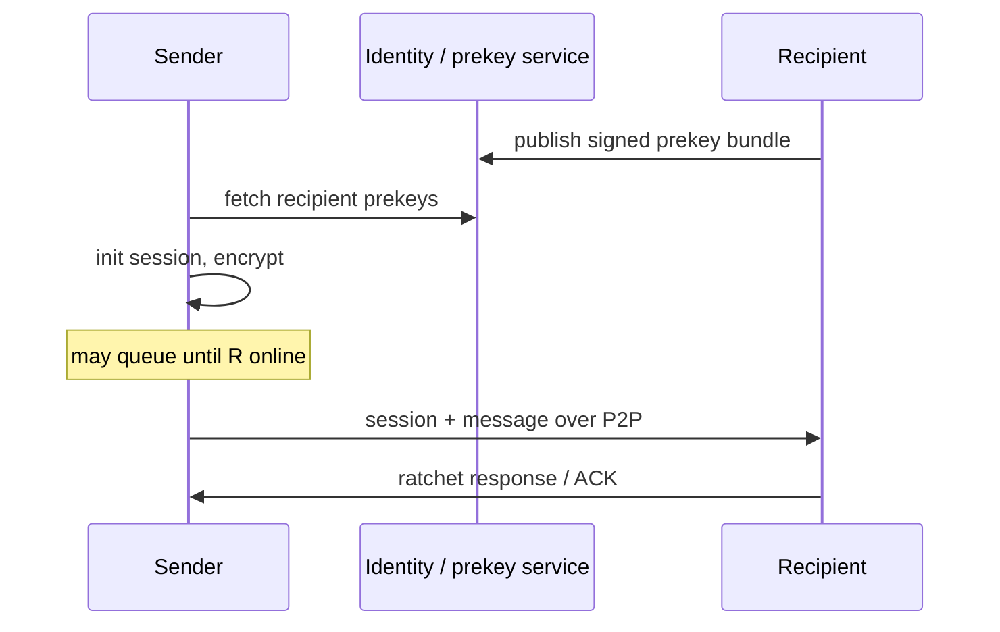

# Cryptography

Use established primitives. **Do not invent custom crypto.**

## Baseline

| Role | Primitive |
|---|---|
| Signatures | Ed25519 |
| Key agreement | X25519 |
| KDF | HKDF |
| AEAD | **XChaCha20-Poly1305** (AD-5) |
| Direct messages | Double Ratchet |
| Private groups | MLS (OpenMLS) |
| Content hashing | BLAKE3 or SHA-256 |
| Message IDs | secure random ≥128-bit |

## Direct messages

Signal-style session design:

- asynchronous initiation where possible
- forward secrecy
- post-compromise security
- per-device sessions
- message key deletion after use

No relay-side offline store means session establishment may need online
overlap unless prekey material is published through identity infrastructure.

Protocol may publish signed one-time prekeys / signed prekey bundles so
session ciphertext can be prepared before a direct connection exists.

## Group messages

MLS or another reviewed group key protocol.

Requirements:

- authenticated membership
- efficient membership updates
- forward secrecy where practical
- creator-controlled membership
- per-device support
- immutable signed message events

Removed members must not decrypt future messages after membership epoch change.

## Public chatrooms

Application-level plaintext allowed for public room content.

Messages must still be **signed**.

Transport encryption still protects network links.

Clients verify signatures before display.

## AEAD (AD-5)

**Locked: XChaCha20-Poly1305** for private payloads / session seals.

Rationale: 192-bit nonces reduce misuse risk in ratchets and queued envelopes;
strong pure-software performance; common in modern messaging stacks.

AES-GCM not required. Do not dual-stack without a real interop need.

## Non-goals

- custom hash constructions for "uniqueness"
- home-grown ratchets
- rolling own group key schedule when MLS fits
- putting long-term decryption keys on relays
