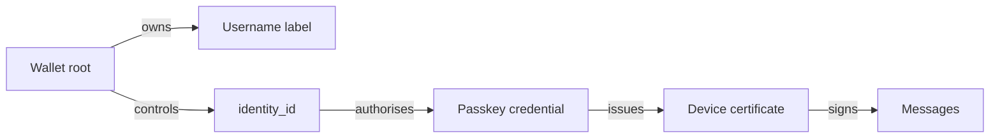

# Identity

## Account root

Each account has a root identity controlled by a wallet.

The wallet is final authority over:

- username ownership
- account identity
- passkey registration
- device authorisation
- username transfers
- account recovery

Accounts are not recoverable without the wallet or credentials the wallet
explicitly authorised.

## Username vs identity

Usernames are:

- globally unique
- first come, first served
- free to register at the application layer
- transferable via blockchain transactions
- permanently recorded in ownership history
- **not** the user's cryptographic identity

A username is a mutable label owned by a wallet.

Stable identity is a cryptographic identity identifier.

```text
username: @max
identity_id: nettle1abc...
wallet_address: ntl1xyz...
```



Old messages stay tied to the **signing identity**, even if the username
later transfers.

Clients should display enough context that transferred names cannot rewrite
perceived authorship of history:

```text
@max
nettle1abc...
```

## Username reservation semantics

- one active owner at a time
- ownership transferable repeatedly
- ownership history immutable
- previous owners retain no control after transfer
- historical messages preserve signing identity
- operators cannot silently reassign names
- prohibited / reserved names defined at genesis or transparent governance

## Passkeys

Users authenticate with passkeys.

Passkeys authorise short-lived client sessions and device keys.

Authority chain:

```text
wallet/root authority
  -> authorises passkey credential
    -> authorises short-lived device certificate
      -> authorises messaging session keys
```

The wallet should **not** sign every chat message.

## Device keys

Each device generates its own device signing and encryption keys.

The account root authorises the device through a signed certificate.

Suggested certificate fields:

```text
device_certificate {
  account_id
  device_id
  device_signing_public_key
  device_encryption_public_key
  issued_at
  expires_at
  capabilities
  root_signature
}
```

Product direction: no complex user-facing device revocation UI in v1.

### Session policy (AD-6 — partial)

**Locked — foreground:** every interactive app open requires a **fresh passkey
authentication** before messaging keys are usable. No “stay logged in” across
cold starts without passkey.

Flow on open:

```text
app open (foreground)
  -> passkey assertion
    -> issue/renew short-lived device certificate
      -> messaging session keys
```

**Open — background:** certificate lifetime / renew rules while the process
stays alive without a new interactive open (see OD-07b).

A stolen device that cannot complete passkey reauth must lose the ability to
renew. Protocol still supports root-level invalidation of compromised
credentials even if the first client hides that complexity.
