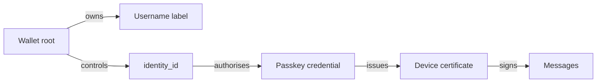

# Identity

## Account root

Each account has a root identity controlled by a wallet.

The wallet address is the account's 32-byte Ed25519 root signing public key.
It verifies device certificates; device keys, not the wallet key, sign messages.

The wallet is final authority over:

- username ownership
- account identity
- passkey registration
- device authorisation
- account recovery

Accounts are not recoverable without the wallet or credentials the wallet
explicitly authorised.

### Recovery (AD-16)

- **Wallet / root key** is ultimate recovery authority.
- A **passkey registered by the wallet** may re-authenticate devices and
  renew certificates without exporting the root key every time.
- Passkey alone cannot change root authority unless the wallet previously
  authorised that capability.
- Lost wallet without backup = lost account control.

## Username vs identity

Usernames are:

- globally unique
- first come, first served
- free to register at the application layer
- non-transferable after registration
- **not** the user's cryptographic identity

A username is a mutable label owned by a wallet.

Stable identity is a cryptographic identity identifier.

```text
username: @max
identity_id: nexnet1abc...
wallet_address: ntl1xyz...
```



Messages remain tied to the signing identity rather than the username label.

## Username reservation semantics

- one active owner at a time **per username**
- **AD-10:** each wallet / identity_id may **own at most one username at a time**
- transfers disabled to prevent squatting and flipping
- historical messages preserve signing identity
- operators cannot silently reassign names
- prohibited / reserved names defined at genesis or transparent governance
- **no** hardware / device mint lock (breaks multi-device, CLI, privacy)

### Anti-spam (AD-10)

```text
max owned per identity: 1
create: free, FCFS, unique
create rate: limited (see consensus / chain params; e.g. 1 create / 24h)
transfer: disabled
hardware binding: none
```

Speculators can still use many wallets. Honest users cannot hoard many names
on one account. Device attestation is not a registration requirement.

## Passkeys

Users authenticate with passkeys.

Passkeys authorise short-lived client sessions and device keys.

The wallet records a signed commitment to each passkey credential. The
commitment binds the credential ID, COSE public key, relying-party ID, and
origin to the identity. A fresh assertion over a single-use, certificate-bound
challenge authorises a device certificate; the chain records that result and
advances the authenticator counter. Receivers resolve that recorded certificate
when it is not independently root-signed.

Authority chain:

```text
wallet/root authority
  -> authorises passkey credential
    -> authorises short-lived device certificate
      -> authorises messaging session keys
```

The wallet should **not** sign every chat message.

## Device keys

Each device generates its own device signing and encryption keys.

The account root may authorise the device through a signed certificate. A
wallet-authorised passkey may also authorise it through the recorded assertion
flow above.

Suggested certificate fields:

```text
device_certificate {
  account_id
  device_id
  device_signing_public_key
  device_encryption_public_key
  issued_at
  expires_at
  capabilities
  root_signature
}
```

Product direction: no complex user-facing device revocation UI in v1.

### Session policy (AD-6)

**Locked:**

1. **Every interactive app open** → fresh **passkey** assertion before
   messaging keys are usable. No stay-logged-in across cold starts.
2. **While process stays alive** (including background) → device certificate
   remains valid until **process death**. No wall-clock TTL for the first
   design.
3. **Process exit / kill / crash** → next open requires passkey again.

Flow:

```text
app open (foreground)
  -> passkey assertion
    -> issue device certificate (valid for process lifetime)
      -> messaging session keys

process still running (background OK)
  -> certificate remains usable

process dies
  -> certificate dead; next open needs passkey
```

A stolen unlocked device with a live process can use the cert until the
process dies; cold start still needs passkey. Protocol still supports
root-level invalidation of compromised credentials even if the first client
hides that complexity.
