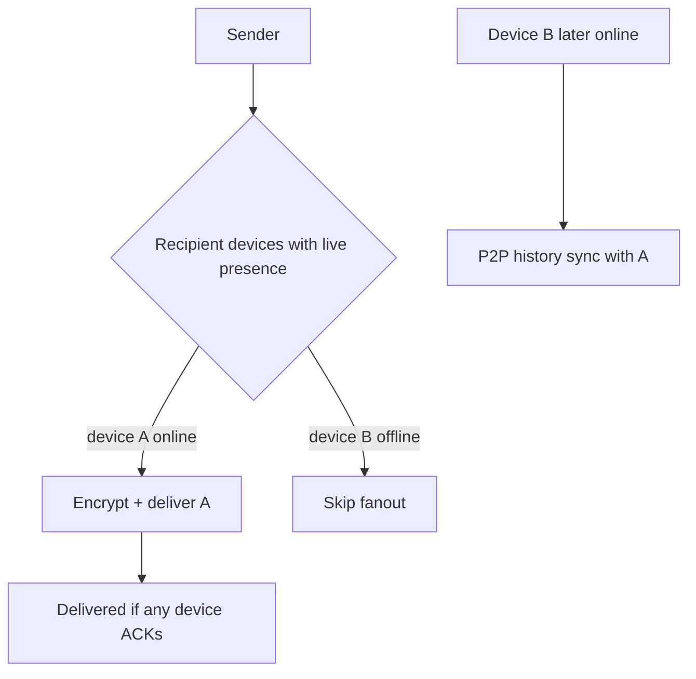
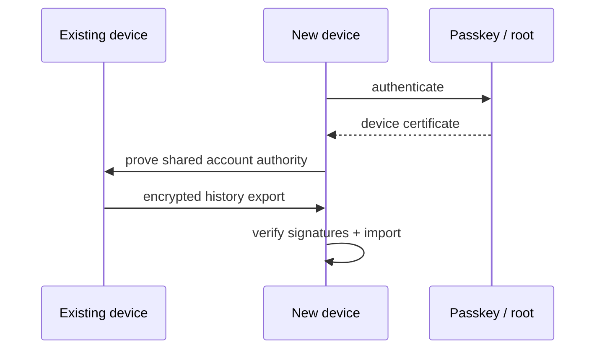

# Multi-device

A Nexnet account may run on multiple devices.

## Login

Each device authenticates with a passkey on every interactive app open and
receives a device certificate valid until process death (AD-6).

## Message fanout (AD-7)

**Locked:** fan out live DMs only to recipient devices that are **online**
(valid presence lease), not to every historically authorised device.

- Sender encrypts per online recipient device session
- Offline recipient devices do **not** receive a sender-side fanout copy
- A message is **delivered** after at least one authorised online device stores it
- Other own-account devices obtain history via **device history sync** when
  they are online together (P2P), not via sender re-fanout to offline devices

## Device history transfer

History transfers peer-to-peer between devices on the same account.

Steps:

1. new device authenticates via passkey
2. receives device certificate
3. devices verify shared account authority
4. encrypted session established
5. existing device exports selected logs
6. new device verifies signatures and imports

## Conflict handling

History is append-only signed events.

If two devices create messages while disconnected, both branches are retained
and merged through deterministic event ordering.

## No cloud backup by default

Nexnet does not provide central message backup by default.

Users keep at least one device copy or transfer history before losing a device.
