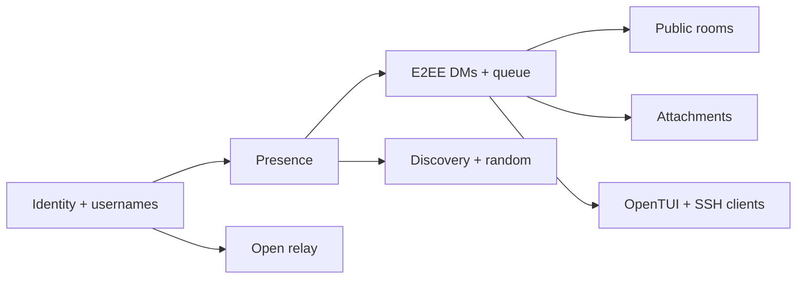

# MVP scope

First usable MVP includes:

- local wallet-backed identity
- passkey login where platform support permits
- local development chain
- free first-come-first-served usernames
- username resolution
- device certificates
- exact online presence
- direct peer signalling
- direct encrypted DMs
- sender-side offline queue
- thirty-minute presence polling
- immediate retry when recipient comes online
- delivered receipts
- immutable local history
- no editing or remote deleting
- one-to-one encrypted attachment transfer
- public chatrooms
- basic interest and language discovery
- random matching with basic reputation
- local blocks
- open-source relay implementation
- OpenTUI reference client
- SSH terminal entry point

## Explicitly not in first MVP

- production token economics
- automated relay rewards
- advanced onion routing
- nearby discovery
- complex mutual graph privacy
- mobile background delivery optimisation
- calls or video
- large-scale public room retention
- governance
- sophisticated recovery
- group ownership transfer
- polished graphical client

See [phases.md](phases.md) for build order.
