# Implementation phases

## Phase 1: Protocol foundations

Build: canonical event types, identity IDs, device certificates, signing and
verification, encrypted local storage, message IDs, append-only conversation
logs, protocol test vectors.

**Implementation plan:**
[`docs/superpowers/plans/2026-07-17-phase1-protocol-foundations.md`](superpowers/plans/2026-07-17-phase1-protocol-foundations.md)

**Accept:**

- deterministic encoding
- signatures verify across independent fixtures
- malformed events rejected
- duplicate events idempotent

## Phase 2: Local direct messaging

Build: two local clients, peer handshake, encrypted session, signed immutable
messages, delivery receipts, sender sequence ordering, local persistence.

**Accept:**

- two clients exchange encrypted messages
- tampered messages fail verification
- duplicate transmission displays once
- delivered status after recipient persistence

## Phase 3: Presence and signalling

Build: relay service, presence leases, presence subscription, session
offers/answers, NAT traversal hooks.

**Accept:**

- exact online status
- offline users expire automatically
- sender receives presence-online event
- direct delivery begins after signalling

## Phase 4: Sender-side offline queue

Build: persistent outbound queue, 30-minute polling, presence-triggered
retry, backoff, ACK processing.

**Accept:**

- message only on sender while recipient offline
- delivers when both online
- relay never stores private message body
- restarts do not lose queue

## Phase 5: Chain identity and usernames

Build: development chain, username registration, identity roots, resolution,
transfer, ownership history.

**Accept:**

- globally unique usernames in chain state
- conflicting registration rejected
- transfers update current owner
- historical signatures stay tied to identity ID

## Phase 6: Public chatrooms

Build: deterministic room IDs, signed room events, peer gossip, relay
subscription, local room history, local blocking.

**Accept:**

- multiple clients converge on room events
- invalid signatures rejected
- subscribe via different relays

## Phase 7: Group chats

Build: creator-owned group state, membership events, MLS integration, fanout,
membership epoch transitions.

**Accept:**

- removed members cannot decrypt future messages
- creator controls membership
- new members do not auto-receive old history

## Phase 8: Discovery and random matching

Build: interest/language profiles, random matching queue, basic reputation,
age/rate limits, private routed mode stub.

**Accept:**

- matching respects language and interest overlap
- blocked users not rematched
- excessive matching throttled

## Phase 9: Attachments

Build: encrypted direct blob transfer, chunking, resume, integrity
verification, pending attachment state.

**Accept:**

- interrupted transfer resumes
- corrupted chunks fail verification
- requires online overlap

## Phase 10: Privacy routing

Build: multi-hop circuits, rotating circuit IDs, layered encryption, path
selection, private random-match transport.

**Accept:**

- destination does not learn sender IP in routed mode
- each relay knows only adjacent hop
- circuit failures recover cleanly

```mermaid
gantt
  title Nexnet implementation phases
  dateFormat X
  axisFormat %s
  section Core
  Phase1 Foundations           :p1, 0, 1
  Phase2 Local DMs             :p2, after p1, 1
  Phase3 Presence signalling   :p3, after p2, 1
  Phase4 Offline queue         :p4, after p3, 1
  section Identity
  Phase5 Chain usernames       :p5, after p2, 1
  section Social
  Phase6 Public rooms          :p6, after p3, 1
  Phase7 Groups                :p7, after p4, 1
  Phase8 Discovery             :p8, after p5, 1
  section Media privacy
  Phase9 Attachments           :p9, after p4, 1
  Phase10 Privacy routing      :p10, after p8, 1
```

Phases 5–6 can track in parallel after Phase 2–3 foundations exist. Phase 9
can parallel Phase 7–8 once DM sessions are solid.
