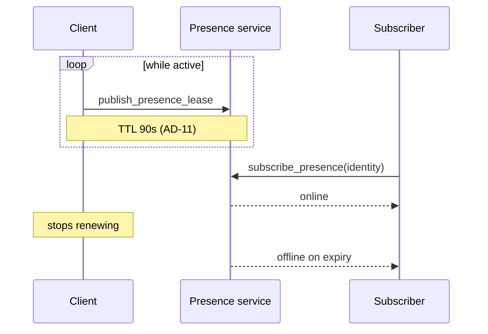

# Presence

Presence is **exact current online status**.

There is **no last-seen** field.

## Presence lease

Short-lived signed leases:

```text
presence_lease {
  identity_id
  device_id
  status: online
  relay_hint?
  issued_at
  expires_at
  nonce
  signature
}
```

**AD-11 locked duration: 90 seconds.**

Clients renew while active (typically before expiry, e.g. ~45–60s).
Expired lease → shown offline.



## Visibility

Access may differ by context:

- private contacts may query exact online state
- group members may see exact online if enabled
- random matching may use online state without global exposure
- public username lookup need not reveal presence to unauthenticated users

First implementation may use exact presence globally for simplicity; API
should allow later visibility controls.

## Metadata

Even without last-seen, presence servers observe behavioural timing.

Presence logs should be minimised and not retained longer than operationally
required.

## Interaction with messaging

- offline → sender enqueues locally
- online event → immediate delivery retry
- poll ceiling remains 30 minutes if events missed

See [messaging.md](messaging.md).
