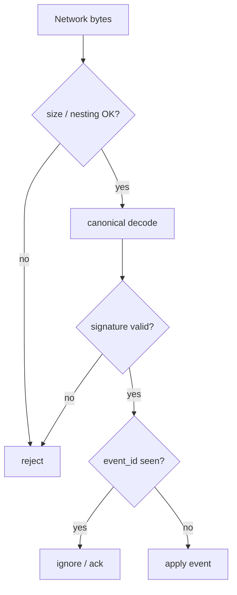

# Protocol event model

Versioned canonical event format.

## Base event

```text
nexnet_event {
  protocol_version
  event_type
  event_id
  author_identity_id
  author_device_id
  created_at
  sequence
  parent_ids[]
  payload
  signature
}
```

## Encoding requirements

- deterministic canonical encoding
- forward-compatible unknown fields
- explicit protocol version
- capability negotiation
- maximum field sizes
- signature over canonical representation

## Encoding (AD-4)

**Locked: H2 — CBOR wire + CDDL schemas + CDE determinism (AD-4 / AD-4b).**

| Layer | Choice |
|---|---|
| Wire bytes | CBOR |
| Determinism | **CDE** (RFC 8949 §4.2 Concise Deterministic Encoding) |
| Human/schema | CDDL describing event shapes |
| Debug tooling | Optional CBOR → diagnostic JSON (not a second protocol) |
| Attachment bodies | Opaque encrypted blobs — not CBOR structure |

Rejected for the signed path: Protobuf (non-canonical encodings), dual
MessagePack+CBOR hybrid, FlatBuffers for events, dCBOR-as-required-profile
(may revisit only if Gordian-style interop appears).

Signatures cover **CDE** bytes of the event excluding the signature field.
All implementations must emit and verify the same CDE encoding.

## Rules

- all schemas versioned
- malformed events rejected (size, nesting, timeouts)
- signature verification before expensive processing where possible
- duplicate events idempotent
- protocol test vectors before network integration



See [cryptography.md](cryptography.md) and [messaging.md](messaging.md).
