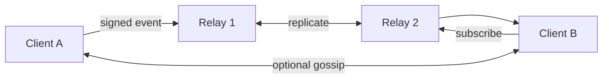

# Public chatrooms

Public rooms resemble Usenet groups or IRC channels.

**No owner.**

## Room identity

Deterministic ID from canonical name (AD-8):

```text
room_id = blake3_derive_key(
  "nexnet room id v1",
  normalized_room_descriptor  // e.g. nexnet://chat/software.rust
)
// 32-byte BLAKE3-256 output
```

## Naming hierarchy

```text
general.chat
software.rust
software.operating-systems
music.experimental
local.melbourne
language.cantonese
```

## Governance

No protocol-level owner of the abstract room identity.

Relays independently decide whether to:

- index the room
- carry traffic
- retain temporary room history
- filter events
- delist the room

Clients independently choose which feeds and moderation lists to trust.

## Moderation model

No protocol-level room moderators in the initial design.

Users retain:

- local block lists
- local filtering
- optional community block lists
- relay selection

Official relays may refuse illegal or abusive content without changing the
underlying room identity.

## Replication

Public room events may propagate through:

- peer gossip
- subscribed relays
- temporary relay caches
- local client history

Unlike private DMs, public events may be cached by relays because content is
public. Retention policy is relay-defined and must be visible.

### Default retention (AD-17)

```text
default: drop room events after 24 hours of inactivity in that room
relays may configure longer or shorter retention
relays must advertise retention policy to clients
```



Messages are application-plaintext-capable but must be signed. Clients verify
before display.
