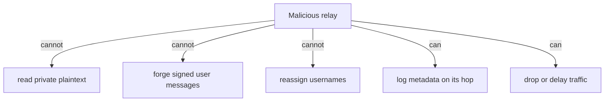

# Threat model

## Defended against

- message forgery
- message tampering
- replay attacks
- duplicate delivery
- malicious relays
- metadata collection (partial mitigations)
- username impersonation
- compromised devices (bounded by certificate lifetime)
- Sybil accounts (matching / rate limits)
- random-match spam
- denial of service
- malformed protocol events
- attachment bombs
- IP exposure (optional routed mode)
- malicious public room content
- blockchain validator censorship
- blockchain reorganisation (app-level handling)

## Trust assumptions

Users trust:

- their own devices
- wallet custody
- passkey providers and platform secure storage
- reviewed cryptographic libraries
- blockchain consensus for username ownership

Users do not need to trust:

- individual relays with plaintext
- random peers
- public room publishers
- discovery services with private message content

## Relay compromise

A compromised relay may:

- log timing
- log IPs visible to it
- delay / drop / censor traffic
- correlate sessions

It must not be able to:

- decrypt private messages
- forge valid user messages
- impersonate authorised devices

## Replay protection

- message IDs
- session epochs
- nonces
- sender sequence numbers
- deduplication databases
- bounded timestamp acceptance where appropriate

## Malformed input

All network input must have:

- explicit size limits
- nesting limits
- parser timeouts
- signature verification before expensive work where possible
- attachment size validation
- decompression limits
